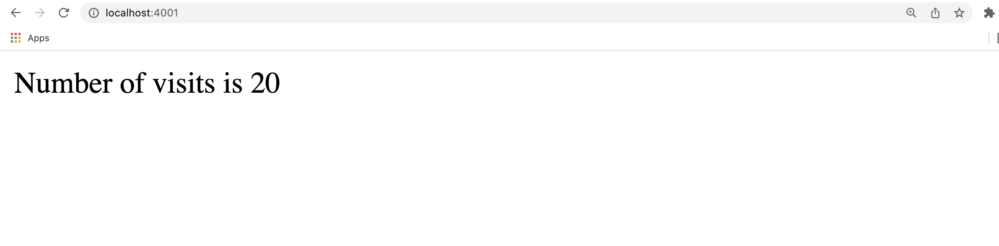

This is a simple app I built while going through
Stephen Grider's [Docker and Kubernetes: The Complete Guide](https://www.udemy.com/course/docker-and-kubernetes-the-complete-guide/) course.

If you have _Docker_ installed, you should be able to run this app by navigating to the app's directory and then running:

> docker-compose up --build

Once you've done that, you should be able to navigate to http://localhost:4001/ and see see something similar to the image below.

Because we've connected two containers (a _NodeJS_ app and a _redis-server_), the number of visits should increment each time we refresh the page.

While this app is both simple and a bit of a contrived example, it was useful to build it to continue to develop my understanding of _Docker_ and also learn the basics of _Docker Compose_.
